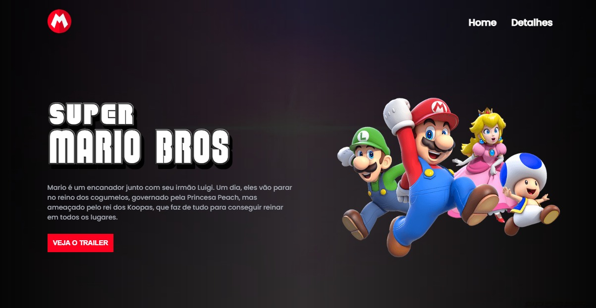
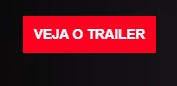
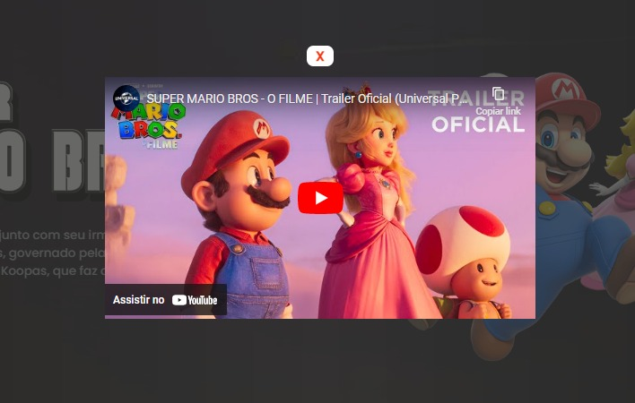

 

#  Landing Page com o trailer do filme: Super Mario Bros
 Como meu primeiro projeto, esta Landing page com o tema do Super Mario Bros, tem o objetivo de exibir o trailer 2 do filme. Composta também por um botão Home e outro Detalhes. 🍄

 ## Tecnologias usadas
 - HTML
 - CSS
 - JS

## Como utilizar
1- Início Landing-page

2- Opções de Cabeçalho

3- Conteúdo e botão do trailer

4- Botão do "Veja o trailer"

5- Ver o trailer ou fechar o player

## Seriços Usados
- GitHub
- VSCode
- GitHub Pages
- Netlify

## Funcionalidades
Principal funcionalidade é exibir o trailer 2 do filme do Super Mário

## Links
- GitPages: https://ricardovcastilho.github.io/landing-page-mario-bros/

- Repositório: https://github.com/RicardoVCastilho/landing-page-mario-bros

## Autor

- Ricardo Vitor Castilho.  
